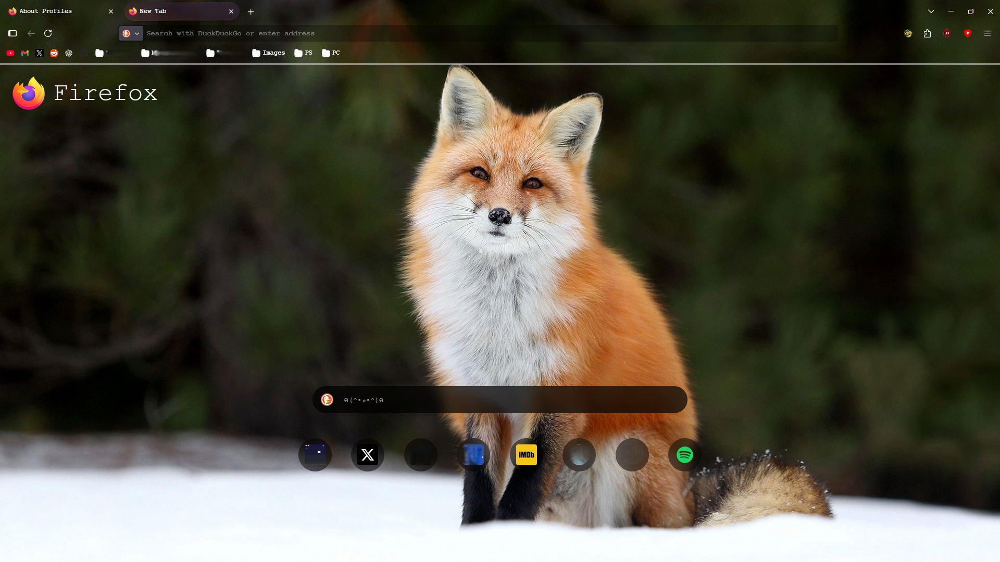

# My Take on Firefox Browser

The whole idea in the beginning was to make a toolbar with an image that I liked,  
and that would go well with the homepage of the browser.  
Now it's a whole theme on it! 🎨



---

## 🔧 Installation Instructions

This theme uses **Firefox's `userChrome.css` and `userContent.css`** customization system.  
Follow the steps below to apply it:

### 1. Enable UserChrome and UserContent support
1. Open Firefox and go to the address bar.
2. Type: `about:config`
3. Accept the warning if prompted.
4. Search for:
   - `toolkit.legacyUserProfileCustomizations.stylesheets`
5. Set it to **`true`**.

### 2. Locate your Firefox profile folder
1. In Firefox, go to: `about:profiles`
2. Look for the desired user section **Root Dictory**.
3. Click **Open Folder**.

### 3. Create a `chrome` folder (if it doesn’t exist)
Inside your profile folder:
- Create a new folder named `chrome`
- Place the provided **`userChrome.css`** and **`userContent.css`**, and of course, the other theme files inside it.

Your structure should look like this:

```
/your-firefox-profile/
└── chrome/
├── userChrome.css
└── userContent.css
```

### 4. Restart Firefox
Close and reopen Firefox.
Your custom theme should now be applied! 🚀

---

## 📸 Screenshots
Here are some Screenshots from the **Screenshots/** folder.


---

## 💡 Notes
- If the theme doesn’t load, double-check that the preference  
  `toolkit.legacyUserProfileCustomizations.stylesheets` is still set to `true`.
- Changes to CSS files require restarting Firefox to take effect.
- Make sure you’re using a **compatible Firefox version** (some UI elements may differ between releases).
- Check your **operating system** (Windows, macOS, Linux), since some styles may behave slightly differently.

---
✨ Enjoy your customized browsing experience!